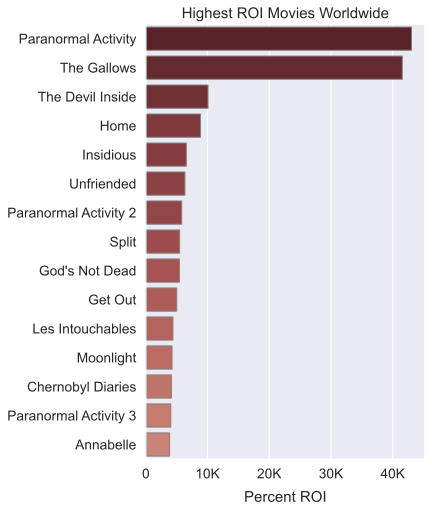

# Movie Genre Profitability for Microsoft

**Author:** Nicholas Gigliotti

## Overview

I conduct an analysis of the profitability of different movie genres in relation to production budget for Microsoft. Microsoft wants to enter the movie business and develop original content. They will have to decide which genres they wish to invest in early on, since different genres have different production requirements. I conclude that Microsoft should invest in horror for low-budget productions and animation for high-budget productions. Horror has the strongest correlation with return on investment (ROI) of any genre, overall. I further conclude that Microsoft should stay away from drama, action, and crime movies because these are negatively correlated with ROI. Finally, I recommend that Microsoft keep their movie budgets under $250M, because ROI sharply declines after that point.

## Business Problem

Microsoft has decided to enter the movie business and create original material. They want to know what kinds of movies are currently profitable, and they want concrete, actionable, insights.

In my analysis, I attempt to answer the following questions for Microsoft:

1. What genres have the strongest correlation with worldwide return on investment?
2. How does budget affect these correlations?
3. Are high or low-budget films more profitable?

### Why Genre?
Different film genres have different markets and different production needs. Some genres are more popular than others, and some cost more to produce. Each genre requires a specialized creative team comprised of actors, writers, set designers, and more. Choosing which genres to invest in is one of the most fundamental early decisions Microsoft will have to make.

### Why Correlation?
Correlation&mdash;and in particular the Pearson correlation coefficient&mdash;is a measure of the strength of the linear relationship between two variables. I focus on correlation because I am interested in the relationships between variables, not simply their central tendencies. Correlation measures something deeper than measures of central tendency, like median or mean. With regard to categorical variables like genres, correlation takes into account what is happening both when a genre is present and when it is absent. For example, if non-crime movies make more money than crime movies, that is captured by the negative correlation between crime and profit. The median profit of crime movies tells you nothing about how they compare with non-crime movies.

### Why Return on Investment?
I focus on return on investment (ROI) as a measure of profitability because it takes budget into account. A low-budget movie may not generate as much profit as a high-budget movie, but it might still be more profitable (in a sense) because it generated more profit *relative* to the initial investment. Measuring profit only reveals investment opportunities with high upfront cost. Microsoft might, for example, want to invest in a large number of low-cost films rather than a small number of expensive films, as this strategy would be lower-risk.

## Data

I use data from two sources in my analysis: [The Numbers](https://www.the-numbers.com/movie/budgets "The Numbers") and the [Internet Movie Database](https://www.imdb.com/interfaces/ "Internet Movie Database") (IMDb). IMDb is an expansive and easily accessible source of movie data which, most importantly, includes genre labels for thousands of films. IMDb lacks financial data, however, so I rely on data from The Numbers. The Numbers is a smaller website run by Nash Information Services, a movie industry research and consulting firm.

## Method
I first create a genre contingency table which contains the `True` and `False` values for every genre relative to each movie. Then I partition the master movie table by budget quartile. Then, for each budget quartile, I compute the Pearson correlations between genre and worldwide ROI. Finally, I plot the correlation values on a heatmap.

    
Afterwards, I create a scatter plot of budget vs. worldwide ROI to examine the relationship between budget and ROI independently of genre.
## Results
### Most Profitable Genres
The following heatmap shows the correlations between genre and worldwide ROI for each budget quartile. Animation is the clear leader in the high-budget quartile, while horror dominates the low-budget quartile.

The correlation scores for the midrange quartiles are lower, but horror and thriller are still at the top of the mix for mid-low budget films. For mid-high budget films, musical and romance movies have the highest correlation.

The following bar chart corroborates the finding that horror is positively correlated with ROI in the low-budget quantile. As it turns out, horror also leads in overall correlation with ROI.

### Budget and ROI
I find that there is almost no correlation between budget and ROI, but ROI drops abruptly around $250M. This drop at the end makes sense, since having a high budget makes it difficult to achieve a decent ROI percentage. Note that the confidence interval goes wide at the end, indicating that in reality the dropoff might not be quite so abrupt.

## Conclusions

#### For high-budget productions, go with animation.
Animation has by far the strongest correlation (nearly 0.25) with ROI for high-budget films. The next best score is adventure, which is nearly 0.1 lower.

#### For low-budget productions, go with horror.
Nothing beats horror movies in terms of ROI, both overall and for low-budget films. The only other options are mystery and thriller, which both go along with horror anyway.

#### Stay away from drama, action, and crime.
Drama, action, and crime consistently show up in the negative on correlation with ROI. This means that movies achieve higher ROI when they are not drama, action, or crime. While it's possible to have success with these genres, they are the worst choices from an investment standpoint.

#### Keep your movie budgets under $250M.
ROI has almost no correlation with budget, but seems to decline sharply after $250M. This is where risk suddenly overtakes reward.

## To Do

- [ ] Write docstrings for cleaning.py
- [ ] Finish docstrings for plotting.py
- [ ] Repeat analysis with TMDB data